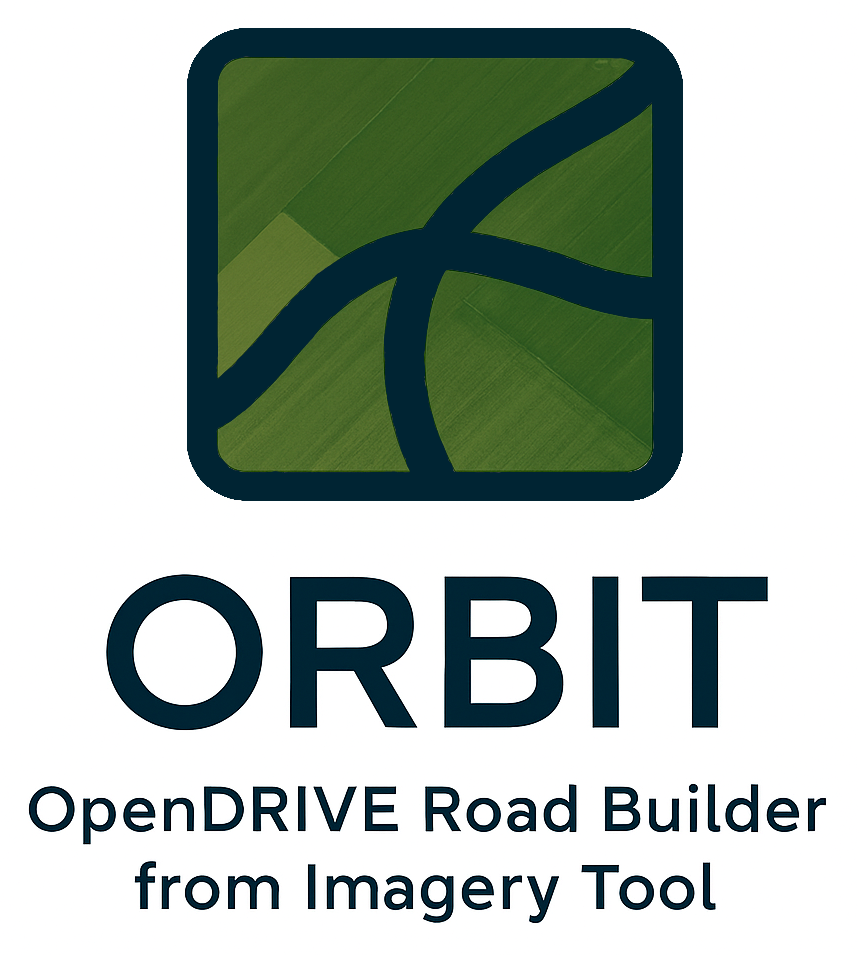

<p align="center">
  
</p>

<h1 align="center">ORBIT</h1>

<p align="center">
  <strong>OpenDrive Road Builder from Imagery Tool</strong><br>
  A visual tool for creating ASAM OpenDRIVE road networks from aerial and satellite imagery.
</p>

<p align="center">
  
  
  
  
</p>

---

## Contents

- [Features](#features)
- [Installation](#installation)
- [Quick Start](#quick-start)
- [Documentation](#documentation)
- [Project Structure](#project-structure)
- [Development](#development)
- [License](#license)

---

## Features

### Road Annotation
- **Interactive polyline drawing** on aerial/satellite/drone images
- **Centerline and lane boundary** distinction with road mark types (solid, broken, etc.)
- **Lane sections** for roads where lane configuration changes
- **Road splitting and merging** for flexible network editing
- **Data-driven road marks** from actual annotated line types
- **OpenDRIVE 1.8 lane attributes** (direction, advisory)

### Junction Support
- **Junction annotation** with drag-and-drop positioning
- **Roundabout wizard** for creating circular intersections
- **Connecting roads** with proper geometric paths through junctions
- **Lane-level connections** with explicit lane-to-lane mappings
- **Automatic connection generation** from road geometry

### Import Capabilities
- **OpenStreetMap import** via Overpass API (roads, signals, junctions, objects)
- **OpenDRIVE import** for editing existing .xodr files (round-trip support)

### Georeferencing
- **Control point system** for pixel-to-geographic transformation
- **CSV import** for batch control points
- **Monte Carlo uncertainty analysis** with visualization
- **Validation metrics** with reprojection error

### Export
- **ASAM OpenDRIVE 1.8** XML format
- **XSD schema validation** against official ASAM schema ([download](https://publications.pages.asam.net/standards/ASAM_OpenDRIVE/ASAM_OpenDRIVE_Specification/latest/specification/))
- **Configurable geometry** — preserve all points or fit curves
- **Geographic reference** with PROJ4 projection string
- **Complete junction export** with connecting roads and lane links

---

## Installation

### Using uv (recommended)

```bash
# Install uv if needed
curl -LsSf https://astral.sh/uv/install.sh | sh

# Clone and install
git clone <repository-url>
cd ORBIT
uv sync
```

### Using pip

```bash
python3 -m venv .venv
source .venv/bin/activate  # Windows: .venv\Scripts\activate
pip install -e .
```

---

## Quick Start

```bash
# Start with an image
orbit path/to/aerial_image.jpg

# Start empty (load image via File menu)
orbit

# Enable verbose logging
orbit --verbose

# Enable XSD schema validation for exports
orbit --xodr_schema /path/to/OpenDRIVE_Core.xsd
```

> **Note**: After installation with `uv sync` or `pip install -e .`, the `orbit` command is available directly. Alternatively, use `uv run orbit` or `python run_orbit.py`.

### Basic Workflow

1. **Load image** — File → Load Image or pass path on command line
2. **Draw centerline** — Click "New Line", trace road center, double-click to finish
3. **Set as centerline** — Double-click polyline, change Line Type to "Centerline"
4. **Draw boundaries** — Trace lane markings with appropriate road mark types
5. **Create road** — Select polylines, press Ctrl+G to group into road
6. **Add control points** — Tools → Georeferencing (minimum 3 points)
7. **Export** — File → Export to OpenDrive

---

## Documentation

| Guide | Description |
|-------|-------------|
| [User Guide](docs/USER_GUIDE.md) | Complete user guide with workflow, tips, and keyboard shortcuts |
| [Georeferencing Guide](docs/GEOREFERENCING.md) | Control points and uncertainty analysis |
| [OSM Import Guide](docs/OSM_IMPORT.md) | OpenStreetMap import feature |
| [Validation Guide](docs/VALIDATION.md) | Validation metrics and uncertainty estimation |
| [Developer Guide](docs/DEV_GUIDE.md) | Architecture and contribution guidelines |

---

## Project Structure

```
orbit/
├── models/       # Data models (Road, Polyline, Junction, Lane, Signal, etc.)
├── gui/          # PyQt6 GUI (MainWindow, ImageView, dialogs, widgets)
├── export/       # OpenDRIVE XML generation (writers, builders)
├── import_/      # OSM and OpenDRIVE importers
└── utils/        # Coordinate transforms, geometry utilities
```

### Project Files

Projects save as `.orbit` JSON files containing:
- Image path and metadata
- Polylines (pixel coordinates)
- Roads with lane sections
- Junctions with connections
- Control points for georeferencing
- Signals and roadside objects

---

## Development

### Setup

```bash
# Install with dev dependencies
uv sync --extra dev

# Run tests
uv run python -m pytest tests/ -v
```

### Key Technologies

- **PyQt6** — GUI framework
- **NumPy/SciPy** — Geometry and transformations
- **lxml** — XML generation
- **pyproj** — Coordinate projections
- **xmlschema** — OpenDRIVE XSD validation

See [Developer Guide](docs/DEV_GUIDE.md) for architecture details.

---

## License

GPL 3.0 License — See [LICENSE](LICENSE) for details.
