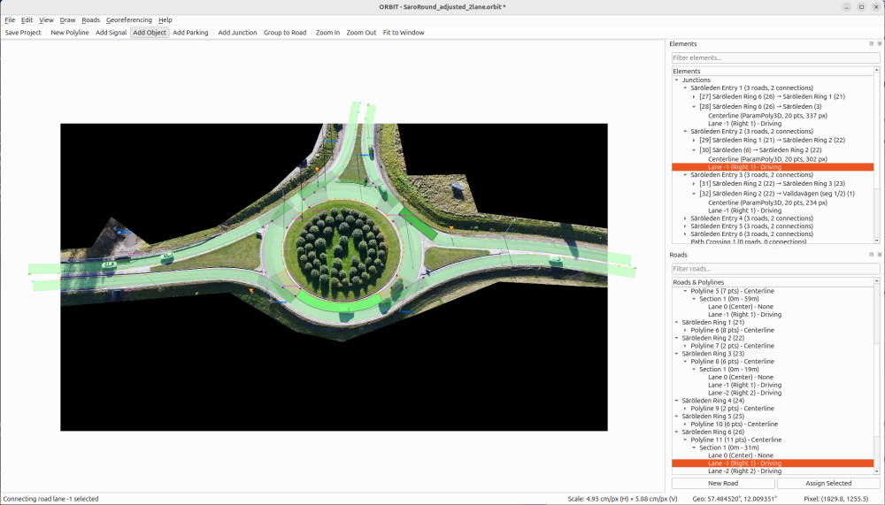

<div align="center">
  
</div>

# ORBIT - OpenDrive Road Builder from Imagery Tool

[](https://github.com/RI-SE/ORBIT/actions/workflows/ci.yml)
[](https://www.gnu.org/licenses/gpl-3.0)
[](https://www.python.org/downloads/)
[](https://www.asam.net/standards/detail/opendrive/)

A visual tool for creating or editing ASAM OpenDRIVE 1.8 road networks from aerial imagery.



> [!NOTE]
> This open source project is maintained by [RISE Research Institutes of Sweden](https://ri.se/). See [LICENSE](LICENSE) file for open source license information.


> [!NOTE]
> This is a beta version. Bugs and missing features should be expected. Github issues can be added for bug reports or feature requests.

---

## Contents

- [Features](#features)
- [Installation](#installation)
- [Quick Start](#quick-start)
- [Documentation](#documentation)
- [Related Packages](#related-packages)
- [Project Structure](#project-structure)
- [Development](#development)
- [License](#license)

---

## Features

### Road Annotation
- **Interactive polyline drawing** on aerial/satellite/drone images
- **Centerline and lane boundary** distinction with road mark types (solid, broken, etc.)
- **Lane sections** for roads where lane configuration changes
- **Road splitting and merging** for flexible network editing
- **Data-driven road marks** from actual annotated line types
- **OpenDRIVE 1.8 lane attributes** (direction, advisory)

### Junction Support
- **Junction annotation** with drag-and-drop positioning
- **Roundabout wizard** for creating circular intersections
- **Connecting roads** with proper geometric paths through junctions
- **Lane-level connections** with explicit lane-to-lane mappings
- **Automatic connection generation** from road geometry

### Import Capabilities
- **OpenStreetMap import** via Overpass API (roads, signals, junctions, objects)
- **OpenDRIVE import** for editing existing .xodr files (round-trip support)

### Georeferencing
- **Control point system** for pixel-to-geographic transformation
- **CSV import** for batch control points
- **Monte Carlo uncertainty analysis** with visualization
- **Validation metrics** with reprojection error

### Export
- **ASAM OpenDRIVE 1.8** XML format
- **XSD schema validation** against official ASAM schema ([download](https://publications.pages.asam.net/standards/ASAM_OpenDRIVE/ASAM_OpenDRIVE_Specification/latest/specification/))
- **Configurable geometry** — preserve all points or fit curves
- **Geographic reference** with PROJ4 projection string
- **Complete junction export** with connecting roads and lane links

---

## Installation

### Using uv (recommended)

```bash
# Install uv if needed
curl -LsSf https://astral.sh/uv/install.sh | sh

# Clone and install
git clone https://github.com/RI-SE/ORBIT.git
cd ORBIT
uv sync
```

### Using pip

```bash
python3 -m venv .venv
source .venv/bin/activate  # Windows: .venv\Scripts\activate
pip install -e .
```

---

## Quick Start

```bash
# Start with an image
orbit path/to/aerial_image.jpg

# Start empty (load image via File menu)
orbit

# Enable verbose logging
orbit --verbose

# Enable XSD schema validation for exports
orbit --xodr_schema /path/to/OpenDRIVE_Core.xsd
```

> **Note**: After installation with `uv sync` or `pip install -e .`, the `orbit` command is available directly. Alternatively, use `uv run orbit` or `python run_orbit.py`.

### Basic Workflow

1. **Load image** — File → Load Image or pass path on command line
2. **Add control points** — Tools → Georeferencing (minimum 4 points (oblique imagery) or 3 (nadir imagery))
3. **Import or draw** — Either import an existing map from OpenStreetMap or OpenDRIVE, or draw roads directly in ORBIT.
4. **Edit** — Edit roads. Add signs, parkings, and objects.
5. **Export** — File → Export → Export to OpenDrive

---

## Documentation

| Guide | Description |
|-------|-------------|
| [User Guide](docs/USER_GUIDE.md) | Complete user guide with workflow, tips, and keyboard shortcuts |
| [Georeferencing Guide](docs/GEOREFERENCING.md) | Control points and uncertainty analysis |
| [OSM Import Guide](docs/OSM_IMPORT.md) | OpenStreetMap import feature |
| [Validation Guide](docs/VALIDATION.md) | Validation metrics and uncertainty estimation |
| [Developer Guide](docs/DEV_GUIDE.md) | Architecture and contribution guidelines |

---

## Related Packages

### [orbit-georef](orbit-georef/)

Standalone Python library for pixel↔geo coordinate transformation. Use it to work with ORBIT's georeferencing outside the GUI — for example, converting pixel coordinates to lat/lon in scripts or downstream tooling. Install separately with `pip install orbit-georef`. See [orbit-georef/README.md](orbit-georef/README.md) for details.

---

## Project Structure

```
orbit/
├── models/       # Data models (Road, Polyline, Junction, ParkingSpace, Signal, etc.)
├── gui/          # PyQt6 GUI (MainWindow, ImageView, dialogs, widgets)
├── export/       # OpenDRIVE XML generation (writers, builders)
├── import/       # OSM and OpenDRIVE importers (loaded via importlib in code)
├── signs/        # Traffic sign libraries (country-specific)
└── utils/        # Coordinate transforms, geometry utilities
orbit-georef/     # Standalone georeferencing library (separate package)
```

### Project Files

Projects save as `.orbit` JSON files containing:
- Image path and metadata
- Polylines (pixel coordinates)
- Roads with lane sections
- Junctions with connections and junction groups
- Control points for georeferencing
- Signals and roadside objects
- Parking spaces

---

## Development

### Setup

```bash
# Install with dev dependencies
uv sync --extra dev

# Run tests
uv run python -m pytest tests/ -v
```

### Key Technologies

- **PyQt6** — GUI framework
- **NumPy/SciPy** — Geometry and transformations
- **lxml** — XML generation
- **pyproj** — Coordinate projections
- **xmlschema** — OpenDRIVE XSD validation

See [Developer Guide](docs/DEV_GUIDE.md) for architecture details.

---

## License

The main ORBIT project is licensed under the [GNU General Public License v3.0 (GPL-3.0)](LICENSE).

The separate library **orbit-georef** (located in `orbit-georef/`) is licensed under the [MIT License](orbit-georef/LICENSE), allowing for more permissive use in downstream projects.

### Dependencies and Their Licenses

**Main ORBIT project (runtime):**
- **PyQt6** - GPL v3 (commercial license available)
- **PyQt6-Qt6** - LGPL v3 (Qt framework bindings)
- **opencv-python** - Apache 2.0
- **NumPy** - BSD 3-Clause License
- **SciPy** - BSD 3-Clause License
- **lxml** - BSD 3-Clause License
- **pyproj** - MIT License
- **xmlschema** - MIT License

**Main ORBIT project (development, optional):**
- **pytest** - MIT License
- **pytest-cov** - MIT License
- **pytest-mock** - MIT License
- **ruff** - MIT License

**orbit-georef library (runtime):**
- **NumPy** - BSD 3-Clause License
- **pyproj** - MIT License

**orbit-georef library (development, optional):**
- **pytest** - MIT License
- **pytest-cov** - MIT License

## Acknowledgement
<br><div align="center">
  
</div>

This package is developed as part of the [SYNERGIES](https://synergies-ccam.eu/) project.

<br><div align="center">
  
</div>

Funded by the European Union. Views and opinions expressed are however those of the author(s) only and do not necessarily reflect those of the European Union or European Climate, Infrastructure and Environment Executive Agency (CINEA). Neither the European Union nor the granting authority can be held responsible for them.
