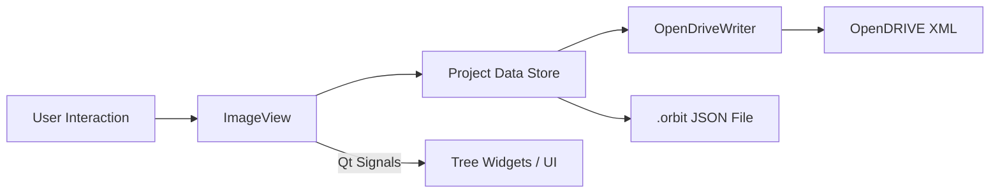

# ORBIT Developer Guide

A guide for developers who want to understand and contribute to ORBIT.

**Prerequisites**: Familiarity with Python 3.10+, basic PyQt/Qt concepts, and ASAM OpenDRIVE format.

---

## Table of Contents

1. [Introduction](#introduction)
2. [Getting Started](#getting-started)
3. [Architecture Overview](#architecture-overview)
4. [Data Models](#data-models)
5. [Coordinate Systems](#coordinate-systems)
6. [Lane Sections](#lane-sections)
7. [Junctions](#junctions)
8. [GUI Architecture](#gui-architecture)
9. [Export Pipeline](#export-pipeline)
10. [Import Pipeline](#import-pipeline)
11. [Development Workflow](#development-workflow)
12. [Code Style](#code-style)
13. [Testing](#testing)

---

## Introduction

ORBIT (OpenDrive Road Builder from Imagery Tool) is a PyQt6 desktop application for creating OpenDRIVE road networks by annotating aerial/satellite imagery. Users draw polylines on images, group them into roads, add georeferencing control points, and export to OpenDRIVE 1.8 XML.

### Core Workflow

```
Image → Draw Polylines → Group into Roads → Add Control Points → Export OpenDRIVE
```

### Why ORBIT?

Creating OpenDRIVE files typically requires expensive commercial tools or manual XML editing. ORBIT provides a visual approach: annotate what you see in imagery, and the tool handles the geometric transformations and XML generation.

---

## Getting Started

### Setup

```bash
# Clone and enter directory
cd ORBIT

# Install dependencies with uv (recommended)
uv sync --extra dev

# Or with pip
pip install -e ".[dev]"
```

### Running

```bash
# Start empty
orbit

# Start with image
orbit path/to/aerial_image.jpg

# Verbose mode (debug logging)
orbit --verbose
```

> **Note**: The `orbit` command is installed via `project.scripts` in pyproject.toml. Use `uv run orbit` if not in PATH.

### Running Tests

```bash
uv run python -m pytest tests/ -v
```

### Project Structure

```
orbit/
├── models/           # Data classes (Road, Polyline, Junction, ParkingSpace,
│                     #   ConnectingRoad, JunctionGroup, SignLibrary, etc.)
├── gui/              # PyQt6 GUI components
│   ├── graphics/     # QGraphicsItem subclasses
│   ├── widgets/      # Tree widgets
│   └── dialogs/      # Property dialogs
├── export/           # OpenDRIVE XML generation
│   ├── opendrive_writer.py
│   ├── lane_builder.py
│   ├── lane_analyzer.py
│   ├── signal_builder.py
│   ├── object_builder.py
│   ├── parking_builder.py
│   ├── reference_validator.py
│   └── georef_export.py
├── import/           # OSM and OpenDRIVE import (use importlib, see note below)
│   ├── osm_importer.py
│   ├── opendrive_importer.py
│   └── junction_analyzer.py
├── signs/            # Traffic sign libraries (country-specific)
│                     #   Manifest-based libraries with sign images and
│                     #   OpenDRIVE type mappings
└── utils/            # Coordinate transforms, geometry, logging
```

---

## Architecture Overview

### Data Flow



```
┌─────────────────┐     ┌─────────────────┐     ┌─────────────────┐
│    ImageView    │────▶│     Project     │────▶│  OpenDriveWriter│
│  (user input)   │     │  (data store)   │     │    (export)     │
└─────────────────┘     └─────────────────┘     └─────────────────┘
        │                       │                       │
        ▼                       ▼                       ▼
   Qt Signals            JSON .orbit file         OpenDRIVE XML
```

1. **User Interaction**: `ImageView` handles mouse/keyboard events, creates/modifies graphics items
2. **Data Storage**: `Project` holds all data (polylines, roads, junctions, control points, signals, objects, parking spaces, junction groups)
3. **UI Updates**: Qt signals propagate changes to tree widgets and other UI components
4. **Export**: `OpenDriveWriter` transforms pixel data to metric coordinates and generates XML

### Key Principle: Pixel-First

All geometric data is stored in **pixel coordinates**. Conversion to geographic or metric coordinates happens only at export time. This keeps the data model simple and allows working with non-georeferenced imagery.

---

## Data Models

All models are Python dataclasses in `orbit/models/`. They implement `to_dict()` and `from_dict()` for JSON serialization.

### Project

Top-level container. Holds all data and manages save/load.

```python
@dataclass
class Project:
    polylines: List[Polyline]
    roads: List[Road]
    junctions: List[Junction]
    control_points: List[ControlPoint]
    signals: List[Signal]
    objects: List[RoadObject]
    junction_groups: List[JunctionGroup]
    parking_spaces: List[ParkingSpace]
    image_path: Optional[str]
    metadata: dict  # version, created, modified
```

### Polyline

A sequence of points drawn on the image.

```python
@dataclass
class Polyline:
    id: str
    points: List[Tuple[float, float]]  # Pixel coordinates
    line_type: LineType  # CENTERLINE or BOUNDARY
    road_mark_type: RoadMarkType  # SOLID, BROKEN, etc.
    color: str
    closed: bool
```

**Important**: Every road needs exactly ONE polyline marked as `LineType.CENTERLINE`. This defines the road's reference line for OpenDRIVE.

### Road

Groups polylines and defines lane configuration.

```python
@dataclass
class Road:
    id: str
    name: str
    polyline_ids: List[str]
    centerline_id: str
    road_type: RoadType
    lane_sections: List[LaneSection]
    speed_limit: Optional[int]
    # Connectivity
    predecessor_id: Optional[str]
    successor_id: Optional[str]
    junction_id: Optional[str]
```

### LaneSection

A segment of road with fixed lane configuration. OpenDRIVE requires new sections where lane count changes.

```python
@dataclass
class LaneSection:
    section_number: int
    s_start: float  # Start position in pixels
    s_end: float    # End position in pixels
    end_point_index: Optional[int]  # Centerline point index
    lanes: List[Lane]
    single_side: Optional[str]  # OpenDRIVE attribute
```

### Lane

Individual lane within a section.

```python
@dataclass
class Lane:
    id: int  # 0=center, negative=right, positive=left
    lane_type: LaneType  # DRIVING, SHOULDER, SIDEWALK, etc.
    width: float  # In meters (not pixels!)
    road_mark_type: RoadMarkType
```

### Junction

Intersection where multiple roads meet. Supports OpenDRIVE 1.8 features including boundary definition and elevation grids.

```python
@dataclass
class Junction:
    id: str
    name: str
    center_point: Optional[Tuple[float, float]]
    geo_center_point: Optional[Tuple[float, float]]
    connected_road_ids: List[str]
    connections: List[JunctionConnection]
    connecting_roads: List[ConnectingRoad]
    lane_connections: List[LaneConnection]
    junction_type: str  # "default" or "virtual"
    # V1.8 features
    boundary: Optional[JunctionBoundary]
    elevation_grid: Optional[JunctionElevationGrid]
    # Roundabout fields
    is_roundabout: bool
    roundabout_center: Optional[Tuple[float, float]]
    geo_roundabout_center: Optional[Tuple[float, float]]
    roundabout_radius: Optional[float]
    roundabout_lane_count: int
    roundabout_clockwise: bool
    entry_roads: List[str]
    exit_roads: List[str]
```

**JunctionBoundary** (`models/junction.py`): Defines the junction area as a counter-clockwise loop of boundary segments. Each `JunctionBoundarySegment` is either a `lane` type (references a road's lane between s-coordinates) or a `joint` type (connects boundary segments at contact points).

**JunctionElevationGrid** (`models/junction.py`): OpenDRIVE 1.8 elevation grid for junction surfaces. Contains a list of `JunctionElevationGridPoint` entries with center, left, and right z-values at a configurable grid spacing.

### ConnectingRoad

Path geometry through a junction, linking an incoming road to an outgoing road (`models/connecting_road.py`).

```python
@dataclass
class ConnectingRoad:
    id: str
    path: List[Tuple[float, float]]          # Pixel coordinates
    geo_path: Optional[List[Tuple[float, float]]]  # Geographic (lon, lat)
    predecessor_road_id: str
    successor_road_id: str
    # Lane configuration
    lane_count_left: int   # Default 0
    lane_count_right: int  # Default 1
    lane_width: float      # Default 3.5m
    lane_width_start: Optional[float]
    lane_width_end: Optional[float]
    lanes: List[Lane]
    # Contact points
    contact_point_start: str  # "start" or "end"
    contact_point_end: str    # "start" or "end"
    # ParamPoly3D geometry
    geometry_type: str  # "parampoly3" or "polyline"
    aU, bU, cU, dU: float  # u(p) polynomial coefficients
    aV, bV, cV, dV: float  # v(p) polynomial coefficients
    p_range: float
    tangent_scale: float
    stored_start_heading: Optional[float]
    stored_end_heading: Optional[float]
```

The ParamPoly3D coefficients define smooth curves through junctions. They are computed from road endpoints and headings, with `tangent_scale` controlling curvature.

### LaneConnection

Lane-level mapping through a junction (`models/lane_connection.py`).

```python
@dataclass
class LaneConnection:
    id: str
    from_road_id: str
    from_lane_id: int   # OpenDRIVE convention: 0=center, -N=right, +N=left
    to_road_id: str
    to_lane_id: int
    connecting_road_id: Optional[str]
    connecting_lane_id: Optional[int]
    turn_type: str      # 'straight', 'left', 'right', 'uturn', 'merge', 'diverge', 'unknown'
```

### JunctionGroup

Groups multiple junctions into a logical unit, an OpenDRIVE 1.8 feature (`models/junction.py`).

```python
@dataclass
class JunctionGroup:
    id: str
    name: Optional[str]
    group_type: str  # 'roundabout', 'complexJunction', 'highwayInterchange', 'unknown'
    junction_ids: List[str]
```

### ParkingSpace

Parking space or lot definition (`models/parking.py`).

```python
class ParkingType(Enum):
    SURFACE = "surface"
    UNDERGROUND = "underground"
    MULTI_STOREY = "multi_storey"
    ROOFTOP = "rooftop"
    STREET = "street"
    CARPORTS = "carports"

class ParkingAccess(Enum):
    STANDARD = "standard"
    WOMEN = "women"
    HANDICAPPED = "handicapped"
    DISABLED = "disabled"
    RESERVED = "reserved"
    COMPANY = "company"
    PERMIT = "permit"
    PRIVATE = "private"
    CUSTOMERS = "customers"
    RESIDENTS = "residents"

@dataclass
class ParkingSpace:
    id: str
    position: Tuple[float, float]           # Pixel coordinates
    geo_position: Optional[Tuple[float, float]]  # Geographic (lon, lat)
    access: ParkingAccess
    parking_type: ParkingType
    road_id: Optional[str]
    name: str
    width: float       # Meters (default 2.5)
    length: float      # Meters (default 5.0)
    orientation: float  # Degrees (default 0.0)
    capacity: Optional[int]
    # Polygon outline
    points: List[Tuple[float, float]]              # Pixel polygon
    geo_points: Optional[List[Tuple[float, float]]] # Geographic polygon
    # Road-relative coordinates (for export)
    s_position: Optional[float]
    t_offset: Optional[float]
```

The `s_position` and `t_offset` fields are calculated relative to the assigned road's centerline for OpenDRIVE export positioning.

### SignLibrary & SignLibraryManager

Country-specific traffic sign libraries (`models/sign_library.py`, `models/sign_library_manager.py`).

```python
@dataclass
class SignDefinition:
    id: str              # Sign ID within library (e.g., "B1", "C31-50")
    name: str
    category_id: str
    library_id: str
    image_filename: Optional[str]
    default_width: float   # Meters
    default_height: float  # Meters
    # OpenDRIVE type mappings
    opendrive_type: str
    opendrive_subtype: str
    opendrive_de_type: str     # German VzKat type
    opendrive_de_subtype: str  # German VzKat subtype
    country_id: str
    osm_id: str
    is_template: bool      # Parameterized sign (e.g., speed limit value)
    template_value: Optional[int]

@dataclass
class SignLibrary:
    id: str            # e.g., "se", "de", "us"
    name: str
    version: str
    country_code: str  # ISO 3166-1
    categories: List[SignCategory]
    signs: List[SignDefinition]
    base_path: Path    # Path to library directory
```

**SignLibraryManager** is a singleton that discovers and loads sign libraries from two locations:
- **App signs path**: `orbit/signs/` (shipped with the application)
- **User signs path**: `~/.orbit/signs/` (user-installed libraries)

Libraries are discovered via `manifest.json` files in each library directory.

### ControlPoint

Pixel-to-geographic coordinate mapping for georeferencing.

```python
@dataclass
class ControlPoint:
    id: str
    name: str
    pixel_x: float
    pixel_y: float
    latitude: float
    longitude: float
```

---

## Coordinate Systems

Understanding coordinate systems is crucial for working with ORBIT.

### Three Coordinate Spaces

1. **Pixel Space** (internal)
   - Origin: top-left of image
   - Units: pixels
   - Used for: all storage, drawing, editing

2. **Geographic Space** (intermediate)
   - WGS84 latitude/longitude
   - Used for: control points, OSM import

3. **Metric Space** (export)
   - Local Transverse Mercator projection
   - Origin: center of control points
   - Units: meters
   - Used for: OpenDRIVE output

### CoordinateTransformer

The `CoordinateTransformer` class handles all conversions:

```python
from orbit.utils import create_transformer

# Create from control points
transformer = create_transformer(control_points)

# Convert pixel to meters
x_m, y_m = transformer.pixel_to_meters(pixel_x, pixel_y)

# Batch conversion
points_m = transformer.pixels_to_meters_batch(pixel_points)

# Get scale factors
scale_x, scale_y = transformer.get_scale_factors()  # meters per pixel
```

### Why Pixel-First?

- Works without georeferencing (for testing/prototyping)
- Simpler data model (no projection complexity in storage)
- Editing operations don't accumulate floating-point errors
- Export can use different projections without re-annotating

---

## Lane Sections

Lane sections are how OpenDRIVE handles varying lane configurations along a road.

### The Problem

A road might have:
- 2 lanes for the first 500m
- 3 lanes (merge) for the next 200m
- 2 lanes again after

OpenDRIVE requires splitting this into 3 `<laneSection>` elements, each with its own lane definitions.

### ORBIT's Approach

Each `Road` has a list of `LaneSection` objects:

```python
road.lane_sections = [
    LaneSection(section_number=1, s_start=0, s_end=500, lanes=[...]),
    LaneSection(section_number=2, s_start=500, s_end=700, lanes=[...]),
    LaneSection(section_number=3, s_start=700, s_end=900, lanes=[...]),
]
```

### Section Boundaries

Section boundaries are tied to centerline points via `end_point_index`:

```python
# Section ends at centerline point 15
section.end_point_index = 15

# Last section extends to end of road
last_section.end_point_index = None
```

When centerline points change, call these methods:

```python
# BEFORE inserting a point
road.adjust_section_indices_after_insertion(point_index)

# BEFORE deleting a point
road.adjust_section_indices_after_deletion(point_index)

# AFTER any centerline modification
road.update_section_boundaries(centerline_points)
```

### Creating Sections

Users split sections via right-click on centerline points:

```python
# In ImageView context menu
road.split_section_at_point(point_index, centerline_points)
```

---

## Junctions

Junctions handle intersections where multiple roads meet.

### Junction Types

- **default**: Normal intersection (T-junction, crossroads)
- **virtual**: Path crossing (e.g., pedestrian path over road) - no actual traffic connection

### Components

1. **Connected Roads**: Roads that meet at the junction
2. **Connecting Roads**: Short road segments through the junction (one per valid path)
3. **Lane Connections**: Lane-to-lane mappings

```python
junction = Junction(
    connected_road_ids=["road_1", "road_2", "road_3"],
    connecting_roads=[
        ConnectingRoad(
            predecessor_road_id="road_1",
            successor_road_id="road_2",
            path=[(100, 100), (120, 110), (150, 120)],
            lane_sections=[...]
        ),
        # ... more connecting roads
    ],
    lane_connections=[
        LaneConnection(
            from_road_id="road_1",
            from_lane_id=-1,
            to_road_id="road_2",
            to_lane_id=-1,
            connecting_road_id="conn_road_1",
            turn_type="right"
        ),
        # ... more lane connections
    ]
)
```

### Automatic Generation

The `JunctionAnalyzer` (`import/junction_analyzer.py`) can automatically generate connecting roads and lane connections based on road geometry:

```python
import importlib

junction_analyzer = importlib.import_module("orbit.import.junction_analyzer")
analyze_junction_geometry = junction_analyzer.analyze_junction_geometry

geometry_info = analyze_junction_geometry(junction, roads_dict, polylines_dict)
# Returns road angles, suggested connections, etc.
```

---

## GUI Architecture

### Main Components

```
MainWindow
├── ImageView (central widget - QGraphicsView)
│   └── QGraphicsScene
│       ├── Image item
│       ├── PolylineGraphicsItem (per polyline)
│       ├── RoadLanesGraphicsItem (per road)
│       │   └── InteractiveLanePolygon (per lane segment)
│       ├── JunctionMarkerItem (per junction)
│       └── ConnectingRoadGraphicsItem (per connecting road)
├── ElementsTreeWidget (left dock)
├── RoadTreeWidget (right dock)
└── Dialogs (modal)
```

### Signal-Slot Pattern

Components communicate via Qt signals:

```python
# ImageView emits signals when data changes
class ImageView(QGraphicsView):
    polyline_added = pyqtSignal(object)
    polyline_modified = pyqtSignal(object)
    road_modified = pyqtSignal(object)

# MainWindow connects signals to handlers
self.image_view.polyline_added.connect(self.on_polyline_added)

def on_polyline_added(self, polyline):
    self.project.add_polyline(polyline)
    self.elements_tree.refresh()
    self.modified = True
```

### Graphics Items

Custom `QGraphicsItem` subclasses in `gui/graphics/`:

| Class | Purpose |
|-------|---------|
| `PolylineGraphicsItem` | Displays polyline with points |
| `InteractiveLanePolygon` | Clickable/hoverable lane polygon |
| `RoadLanesGraphicsItem` | Container for road's lane polygons |
| `JunctionMarkerItem` | Junction center marker |
| `ConnectingRoadGraphicsItem` | Junction connecting road path |

### Adding a New Dialog

1. Create `gui/dialogs/my_dialog.py`:

```python
from PyQt6.QtWidgets import QDialog, QVBoxLayout, QDialogButtonBox

class MyDialog(QDialog):
    def __init__(self, data, parent=None):
        super().__init__(parent)
        self.data = data
        self.setup_ui()
        self.load_data()

    def setup_ui(self):
        layout = QVBoxLayout(self)
        # Add widgets...

        buttons = QDialogButtonBox(
            QDialogButtonBox.StandardButton.Ok |
            QDialogButtonBox.StandardButton.Cancel
        )
        buttons.accepted.connect(self.accept)
        buttons.rejected.connect(self.reject)
        layout.addWidget(buttons)

    def load_data(self):
        # Populate widgets from self.data
        pass

    def accept(self):
        # Save widget values to self.data
        super().accept()
```

2. Add menu action in `MainWindow`:

```python
def create_actions(self):
    self.my_action = QAction("My Feature", self)
    self.my_action.triggered.connect(self.show_my_dialog)

def show_my_dialog(self):
    dialog = MyDialog(self.some_data, self)
    if dialog.exec() == QDialog.DialogCode.Accepted:
        self.modified = True
```

---

## Export Pipeline

### OpenDriveWriter

The main export class in `export/opendrive_writer.py`:

```python
writer = OpenDriveWriter(
    project=project,
    transformer=transformer,  # CoordinateTransformer
    preserve_geometry=True,   # Keep all polyline points
    country_code="se"
)

success = writer.write(output_path)
```

### Export Process

1. **Validate references** via `ReferenceValidator`
2. **Create header** with geoReference (PROJ4 string)
3. **For each road**:
   - Convert centerline to meters
   - Fit geometry (lines/arcs/clothoids) via `CurveFitter`
   - Calculate road length
   - Export lane sections via `LaneBuilder`
   - Export signals via `SignalBuilder`
   - Export objects via `ObjectBuilder`
   - Export parking via `ParkingBuilder`
4. **For each junction**:
   - Export connecting roads
   - Export lane connections

### Builder Classes

Export logic is split into focused builders:

| Class | File | Responsibility |
|-------|------|----------------|
| `LaneBuilder` | `lane_builder.py` | `<lanes>` element with sections |
| `SignalBuilder` | `signal_builder.py` | `<signals>` element |
| `ObjectBuilder` | `object_builder.py` | `<objects>` element |
| `ParkingBuilder` | `parking_builder.py` | `<object>` elements for parking spaces |
| `LaneAnalyzer` | `lane_analyzer.py` | Analyzes boundary geometry for lane widths |

### ParkingBuilder

Creates OpenDRIVE `<object>` XML elements for parking spaces (`export/parking_builder.py`).

- Maps pixel-space parking positions to road s/t coordinates using centerline length ratios
- Creates `<parkingSpace>` child elements with access and restriction attributes
- Supports polygon outlines via `<cornerLocal>` elements in the parking space's local coordinate system

### LaneAnalyzer

Analyzes lane boundaries relative to centerlines to determine measured lane widths (`export/lane_analyzer.py`).

```python
analyzer = LaneAnalyzer(project, right_hand_traffic=True, transformer=transformer)
boundary_infos, warnings = analyzer.analyze_road(road)
widths = analyzer.suggest_lane_widths(road)
# Returns {'average': 3.4, 'min': 3.1, 'max': 3.7, 'std': 0.2} in meters
```

Key capabilities:
- Calculates signed perpendicular offsets from boundary points to centerline
- Assigns boundaries to lane IDs based on lateral position
- Measures width between consecutive boundaries
- Validates assignments against expected lane counts

### ReferenceValidator

Validates all cross-references in a project before export (`export/reference_validator.py`).

```python
from orbit.export.reference_validator import validate_references

warnings = validate_references(project)
# Returns list of human-readable warning strings, empty if all valid
```

Checks references across all entity types: roads, junctions, connecting roads, lane connections, signals, objects, parking spaces, junction groups, and lane boundary polylines.

### GeorefExporter

Exports georeferencing parameters to a portable JSON format (`export/georef_export.py`).

```python
from orbit.export.georef_export import export_georeferencing

success = export_georeferencing(project, output_path, transformer, image_size)
```

The exported JSON includes:
- Control points (pixel and geographic coordinates)
- Transformation matrices (forward and inverse)
- Scale factors (meters per pixel)
- Reprojection and validation error statistics
- Transform method (affine or homography)

### Geometry Fitting

`CurveFitter` converts polylines to OpenDRIVE geometry:

```python
fitter = CurveFitter(
    line_tolerance=0.1,  # Max deviation for lines (meters)
    arc_tolerance=0.5    # Max deviation for arcs (meters)
)

elements = fitter.fit_polyline(points_meters)
# Returns list of GeometryElement (LINE, ARC, or SPIRAL)
```

With `preserve_geometry=True`, each polyline segment becomes a separate line element (no fitting).

---

## Import Pipeline

### OSM Import

Imports road networks from OpenStreetMap via Overpass API:

```python
import importlib

osm_importer_module = importlib.import_module("orbit.import.osm_importer")
OSMImporter = osm_importer_module.OSMImporter

importer = OSMImporter(project, transformer)
stats = importer.import_from_bbox(
    min_lat, min_lon, max_lat, max_lon,
    detail_level="moderate"  # or "full"
)
```

**Flow**:
1. Query Overpass API for roads/signals/objects in bounding box
2. Parse OSM JSON into intermediate objects
3. Convert to ORBIT models (Road, Signal, RoadObject)
4. Detect junctions where roads meet
5. Generate connecting roads via `JunctionAnalyzer`

### OpenDRIVE Import

Round-trip import from existing OpenDRIVE files:

```python
import importlib

opendrive_importer_module = importlib.import_module("orbit.import.opendrive_importer")
import_opendrive = opendrive_importer_module.import_opendrive

project = import_opendrive(xodr_path, transformer)
```

Useful for editing existing OpenDRIVE or testing export accuracy.

---

## Development Workflow

### Adding a New Model Field

1. Add field to dataclass:
```python
@dataclass
class Road:
    # ... existing fields ...
    new_field: Optional[str] = None
```

2. Update serialization:
```python
def to_dict(self):
    data = {
        # ... existing fields ...
        'new_field': self.new_field,
    }
    return data

@classmethod
def from_dict(cls, data):
    return cls(
        # ... existing fields ...
        new_field=data.get('new_field'),  # Default for old files
    )
```

3. Add UI if needed (dialog, tree column, etc.)

### Adding Export Support for New Element

1. Create builder method or class in `export/`
2. Call from `OpenDriveWriter._create_road()` or similar
3. Test with OpenDRIVE validator

### Adding a Parking Type or Access Category

1. Add enum value to `ParkingType` or `ParkingAccess` in `models/parking.py`
2. The parking dialog (`gui/dialogs/`) automatically picks up new enum values
3. Update `ParkingBuilder` in `export/parking_builder.py` if the new type requires special XML attributes
4. Add tests in `tests/unit/test_models/`

### Debugging Tips

- Use `--verbose` flag for debug logging
- Check `self.scene.items()` for graphics item issues
- Use `to_dict()` to inspect model state
- Export and view in esmini for visual validation

---

## Code Style

### Type Hints

Always use type hints:

```python
def calculate_distance(
    p1: Tuple[float, float],
    p2: Tuple[float, float]
) -> float:
    """Calculate Euclidean distance between two points."""
    dx = p2[0] - p1[0]
    dy = p2[1] - p1[1]
    return math.sqrt(dx * dx + dy * dy)
```

### Imports

```python
# Standard library
from dataclasses import dataclass
from typing import List, Optional, Tuple

# Third-party
from PyQt6.QtWidgets import QDialog
import numpy as np

# Local
from orbit.models import Road, Polyline
from orbit.utils import create_transformer
```

### Naming

- Classes: `PascalCase`
- Functions/methods: `snake_case`
- Constants: `UPPER_CASE`
- Private: `_leading_underscore`
- Qt overrides: `camelCase` (framework convention)

### Docstrings

```python
def transform_point(self, x: float, y: float) -> Tuple[float, float]:
    """
    Transform pixel coordinates to meters.

    Args:
        x: Pixel x-coordinate
        y: Pixel y-coordinate

    Returns:
        Tuple of (x_meters, y_meters) in local projection

    Raises:
        ValueError: If transformer not initialized
    """
```

---

## Testing

### Running Tests

```bash
# All tests
uv run python -m pytest tests/ -v

# Specific module
uv run python -m pytest tests/unit/test_models/test_road.py -v

# With coverage
uv run python -m pytest tests/ --cov=orbit --cov-report=term-missing
```

### Test Structure

```
tests/
├── unit/
│   ├── test_models/      # Model class tests
│   ├── test_export/      # Export tests
│   └── test_utils/       # Utility function tests
├── integration/          # Multi-component tests
└── conftest.py          # Pytest fixtures
```

### Writing Tests

```python
import pytest
from orbit.models import Road, LaneSection, Lane, LaneType

class TestRoadSections:
    def test_split_section(self):
        """Test splitting a section at a point."""
        road = Road()
        road.lane_sections = [
            LaneSection(
                section_number=1,
                s_start=0.0,
                s_end=300.0,
                lanes=[Lane(id=0, lane_type=LaneType.NONE, width=0.0)]
            )
        ]

        points = [(0, 0), (100, 0), (200, 0), (300, 0)]
        success = road.split_section_at_point(2, points)

        assert success
        assert len(road.lane_sections) == 2
```

### Manual Testing

For GUI changes, test manually:

1. Load test image
2. Draw polylines, create roads
3. Add control points (georeferencing)
4. Export to OpenDRIVE
5. Validate with esmini or other viewer

---

## Quick Reference

### Key Files

| File | Purpose |
|------|---------|
| `run_orbit.py` | Entry point (provides `orbit` command) |
| `models/project.py` | Project container, save/load |
| `models/road.py` | Road with lane sections |
| `models/parking.py` | ParkingSpace, ParkingType, ParkingAccess |
| `models/connecting_road.py` | ConnectingRoad with ParamPoly3D geometry |
| `models/junction.py` | Junction, JunctionGroup, JunctionBoundary |
| `models/sign_library.py` | SignDefinition, SignLibrary, SignCategory |
| `models/sign_library_manager.py` | SignLibraryManager (singleton loader) |
| `models/lane_connection.py` | LaneConnection |
| `gui/image_view.py` | Main drawing canvas |
| `gui/main_window.py` | Application window |
| `export/opendrive_writer.py` | XML generation |
| `export/parking_builder.py` | Parking space XML export |
| `export/lane_analyzer.py` | Lane width analysis from boundaries |
| `export/reference_validator.py` | Cross-reference validation |
| `export/georef_export.py` | Georeferencing JSON export |
| `utils/coordinate_transform.py` | Pixel ↔ meter conversion |

### Common Operations

```python
# Get road's centerline polyline
centerline = project.get_polyline(road.centerline_id)

# Get transformer for export
transformer = create_transformer(project.control_points)

# Convert coordinates
x_m, y_m = transformer.pixel_to_meters(px, py)

# Access lane in section
lane = road.get_lane(lane_id=-1, section_number=1)

# Split section at point
road.split_section_at_point(point_index, centerline.points)

# Validate project references before export
from orbit.export.reference_validator import validate_references
warnings = validate_references(project)
```

### OpenDRIVE Lane IDs

```
Left lanes:   +3  +2  +1
Center lane:       0
Right lanes:  -1  -2  -3
              ←  travel direction
```

For right-hand traffic, vehicles drive in negative-ID lanes.
