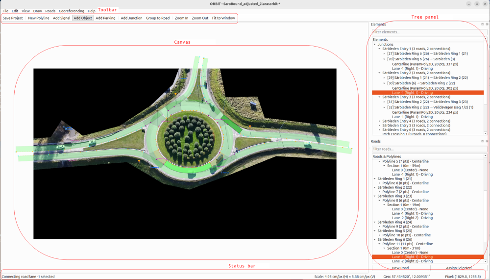
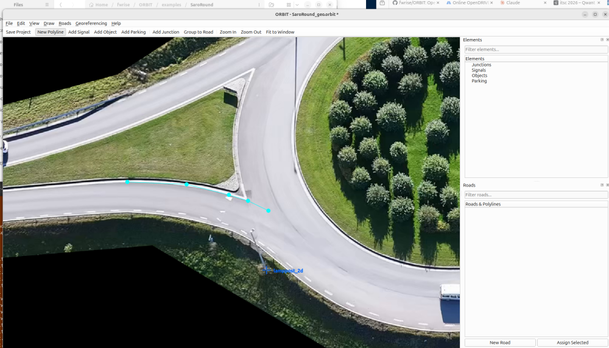
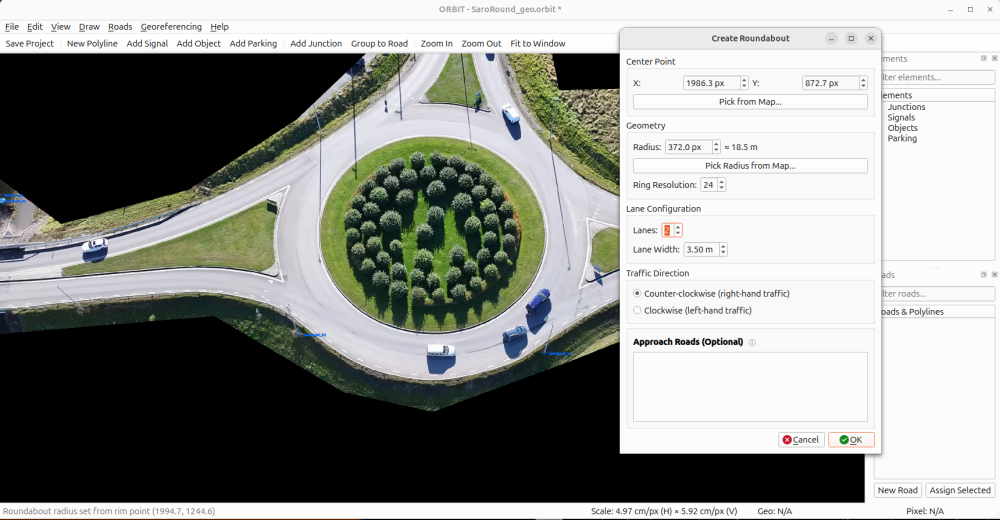
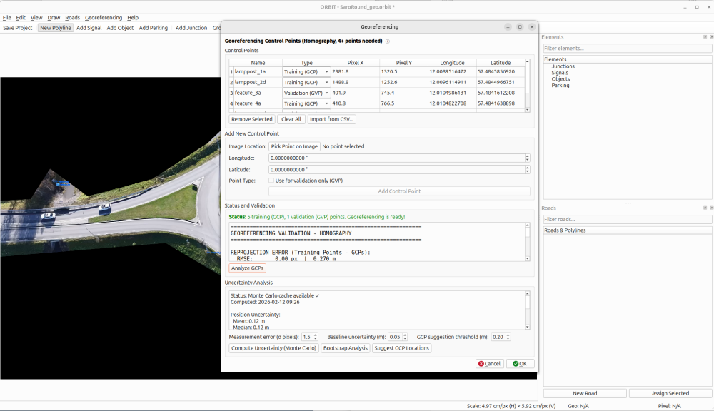
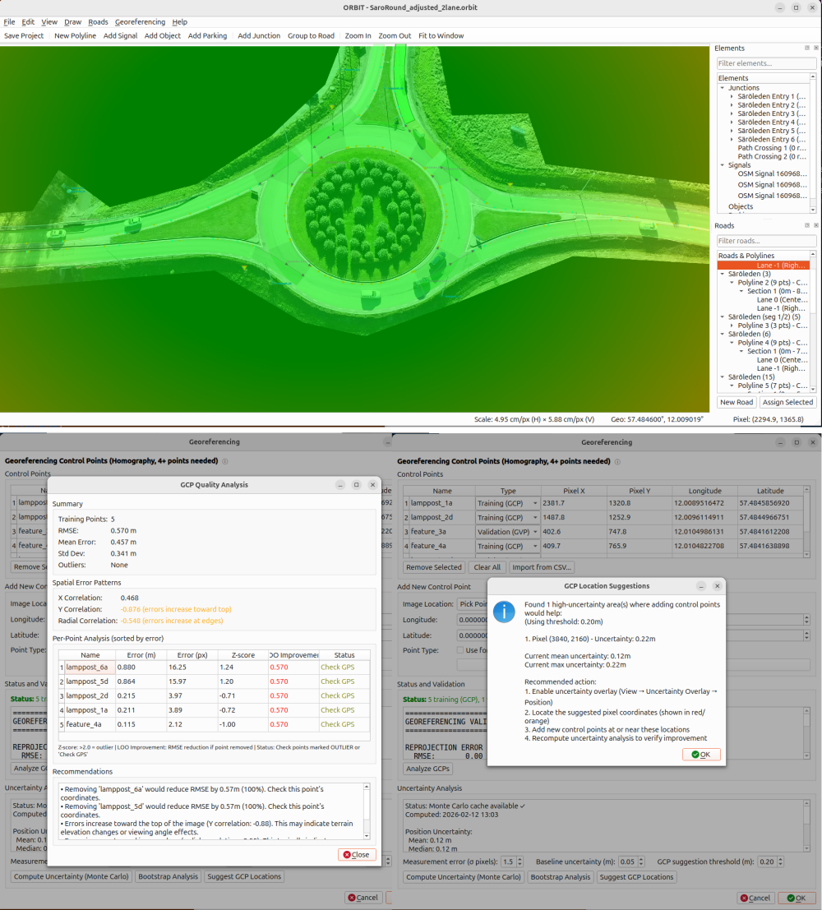
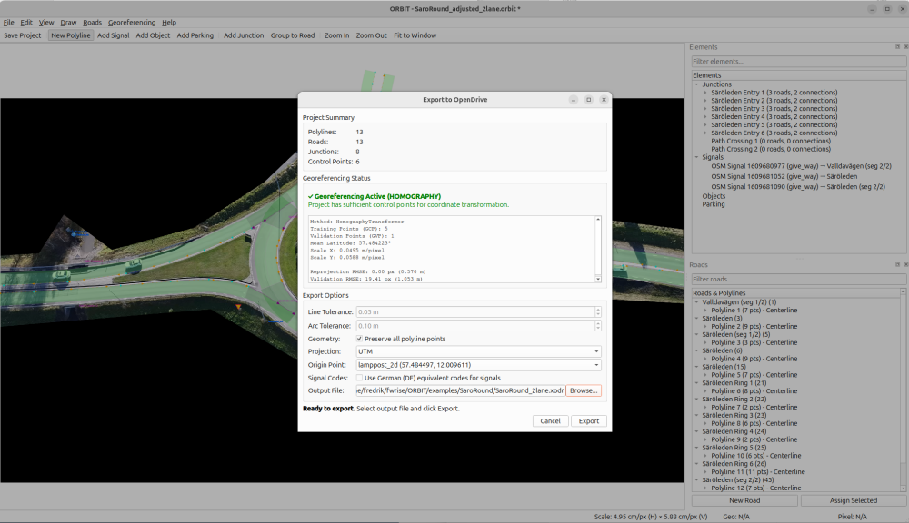

# ORBIT User Guide

Complete guide for creating OpenDRIVE road networks from aerial imagery using ORBIT.

**Version**: 0.6.0 | **OpenDRIVE**: 1.8

---

## Contents

- [Getting Started](#getting-started)
- [Basic Workflow](#basic-workflow)
- [Drawing Polylines](#drawing-polylines)
- [Creating Roads](#creating-roads)
- [Lane Sections](#lane-sections)
- [Junctions](#junctions)
- [Connecting Roads](#connecting-roads)
- [Junction Groups](#junction-groups)
- [Lane Connections](#lane-connections)
- [Signals & Objects](#signals--objects)
- [Parking Spaces](#parking-spaces)
- [Georeferencing](#georeferencing)
- [Import Features](#import-features)
- [Export to OpenDRIVE](#export-to-opendrive)
- [View Controls](#view-controls)
- [Preferences](#preferences)
- [Keyboard Shortcuts](#keyboard-shortcuts)
- [Troubleshooting](#troubleshooting)
- [Best Practices](#best-practices)

---

## Getting Started

### Installation

```bash
# Using uv (recommended)
uv sync

# Or using pip
pip install -e .
```

### Launch

```bash
# Start with image
orbit path/to/aerial_image.jpg

# Start empty (load image via File menu)
orbit

# Enable verbose logging
orbit --verbose

# Enable XSD schema validation for exports
orbit --xodr_schema /path/to/OpenDRIVE_Core.xsd
```

> **Note**: If `orbit` is not in your PATH, use `uv run orbit` instead.

---

## Basic Workflow



The typical workflow from aerial image to OpenDRIVE export:

```
Load Image → Draw Polylines → Create Roads → Add Junctions → Georeference → Export
```

### Quick Start Example

1. **Load image**: `orbit intersection.jpg` or File → Load Image
2. **Draw centerline**: Click "New Line", trace road center, double-click to finish
3. **Set as centerline**: Double-click polyline, change Line Type to "Centerline"
4. **Draw boundaries**: Trace lane markings with appropriate road mark types
5. **Create road**: Select polylines, press Ctrl+G to group into road
6. **Add control points**: Tools → Georeferencing (minimum 3 points)
7. **Export**: File → Export to OpenDrive

---

## Drawing Polylines



Polylines represent road centerlines and lane boundaries.

### Line Types

| Type | Color | Purpose |
|------|-------|---------|
| **Centerline** | Orange | Road reference line (exactly one per road) |
| **Lane Boundary** | Cyan | Visual lane markings (solid, broken, etc.) |

New polylines default to **Lane Boundary**. Change type via double-click.

### Drawing Operations

**Start Drawing**:
- Click "New Line" button (right sidebar)
- Or press **Ctrl+P**
- Or menu: Tools → New Polyline

**Add Points**:
- Click on image to add points
- Points connect with colored lines

**Finish Polyline**:
- **Double-click** to finish
- Or press **Enter**
- Or press **Escape** to cancel

### Editing Points

| Action | How |
|--------|-----|
| Move point | Click and drag |
| Insert point | Ctrl+Click on line segment |
| Delete point | Right-click on point |
| Delete polyline | Select + Delete key |

### Batch Delete

For deleting multiple items at once:

1. Use area selection to select multiple items on the canvas
2. Press **Delete** or use Edit → Delete Selected
3. A confirmation dialog appears showing all items to be deleted in a tree view
4. Review and confirm to delete

### Polyline Properties

Double-click a polyline to edit:

- **Line Type**: Centerline or Lane Boundary
- **Road Mark Type** (for boundaries): solid, broken, solid solid, solid broken, etc.

---

## Creating Roads

Roads group polylines and define lane configuration.

### Method 1: Quick Creation

1. Select a polyline by clicking on it
2. Press **Ctrl+G** (or Tools → Group to Road)
3. Fill in road properties
4. Click OK

### Method 2: Create Empty Road First

1. Open Roads panel (right sidebar)
2. Click "New Road"
3. Fill in properties
4. Assign polylines later via "Assign Selected"

### Road Properties

**Basic Properties**:
- **Road Name**: Descriptive name (e.g., "Main Street")
- **Road Type**: ASAM OpenDRIVE road type (motorway, town, rural, etc.)
- **Speed Limit**: In km/h (0 = no limit)

**Centerline Selection**:
- Green: Exactly one centerline (correct)
- Orange: No centerline (needs one)
- Red: Multiple centerlines (only one allowed)

**Lane Configuration**:
- **Left/Right Lanes**: Number of lanes in each direction
- **Lane Width**: Default width in meters (1.0-10.0m, default 3.5m)
- **Traffic Direction**: Right-hand (default) or left-hand traffic

### Roads Panel Operations

The Roads panel shows a hierarchical tree:

```
├─ Highway 101 (motorway) - 100 km/h
│  ├─ Polyline (5 points)
│  └─ Polyline (8 points)
├─ Main Street (town) - 50 km/h
│  └─ Polyline (12 points)
└─ Unassigned Polylines
   └─ Polyline (3 points)
```

- **Double-click** road → Edit properties
- **Right-click** road → Context menu (Edit, Delete)
- **Double-click** polyline → Highlight in view

---

## Lane Sections

Roads can be divided into sections where lane configuration changes.

### Creating Sections

1. Right-click on a centerline point
2. Select "Split Section Here"
3. A new section is created with the same lane configuration
4. Edit each section independently

### Editing Sections

1. In Road Tree, expand road to see sections
2. Double-click section or right-click → "Edit Section Properties"
3. Modify the `singleSide` attribute if needed (OpenDRIVE attribute)

### Section Properties

- **Section Number**: Sequential numbering (1, 2, 3...)
- **s_start / s_end**: Position along centerline
- **singleSide**: OpenDRIVE attribute (left, right, or none)

---

## Junctions

Junctions handle intersections where multiple roads meet.

### Creating a Junction

1. Press **Ctrl+J** or Tools → Add Junction
2. Click on the map where the intersection is located
3. Fill in junction properties:
   - **Junction Name**: e.g., "Main & Oak Intersection"
   - **Junction Type**: default or virtual
   - **Connected Roads**: Select and add roads
4. Click OK

### Junction Operations

- **Move junction**: Click and drag the marker
- **Edit junction**: Double-click the marker
- **Delete junction**: Select + Delete key
- **Merge Selected Roads**: Roads → Merge Selected Roads (merges roads that share a junction endpoint)

### Junction Types

- **default**: Normal intersection (T-junction, crossroads)
- **virtual**: Path crossing without traffic connection

### Roundabout Wizard



Create roundabouts via Tools → Create Roundabout (**Ctrl+Shift+R**):

- **Center Point**: Click "Pick on Map" or enter coordinates
- **Radius**: Inner and outer radius
- **Lanes**: Number of circular lanes
- **Traffic Direction**: Clockwise or counter-clockwise
- **Approach Roads**: Select connecting roads

---

## Connecting Roads

Connecting roads define the paths vehicles take through junctions. Each connecting road links an incoming road to an outgoing road with its own geometry.

### What Are Connecting Roads?

In OpenDRIVE, junctions contain short road segments (connecting roads) that describe each valid path through the intersection. For example, a T-junction might have connecting roads for left-turn, right-turn, and through movements.

### Editing Connecting Roads

1. In the Elements tree, expand a junction to see its connecting roads
2. Right-click a connecting road → **Edit Properties**
3. Configure:
   - **Lane Configuration**: Left and right lane counts
   - **Contact Points**: Start/end contact point for predecessor and successor roads
   - **Geometry Type**: ParamPoly3D (smooth curve) or Polyline
   - **Tangent Scale**: Adjusts the curvature of ParamPoly3D geometry (higher values produce wider curves)

### ParamPoly3D Geometry

Connecting roads use parametric cubic polynomials (ParamPoly3D) for smooth curves through junctions. The geometry is defined by polynomial coefficients (aU, bU, cU, dU, aV, bV, cV, dV) that are typically computed automatically from the road endpoints and headings.

Use the **Tangent Scale** slider to adjust how tightly the connecting road curves between its endpoints.

---

## Junction Groups

Junction groups combine multiple junctions into a logical unit, as defined in OpenDRIVE 1.8.

### Creating Junction Groups

1. Go to **Edit → Junction Groups**
2. Click "Add Group"
3. Set group properties:
   - **Name**: Descriptive name
   - **Group Type**: One of:
     - `roundabout` — for roundabout junctions
     - `complexJunction` — for complex multi-junction intersections
     - `highwayInterchange` — for highway interchange structures
4. Assign junctions to the group from the available junctions list

---

## Lane Connections

Lane connections define the lane-level mappings through junctions — which incoming lane connects to which outgoing lane.

### Editing Lane Connections

1. Right-click a junction in the Elements tree → **Edit Lane Connections**
2. The connection table shows:
   - **From Road / Lane**: Incoming road and lane ID
   - **To Road / Lane**: Outgoing road and lane ID
   - **Connecting Road**: The connecting road providing the geometry
   - **Turn Type**: straight, left, right, uturn, merge, or diverge
   - **Priority**: Connection priority value
3. Use **Auto-Generate** to automatically create lane connections based on road geometry and lane counts

---

## Signals & Objects

### Signals (Traffic Signs)

Place traffic signs from country-specific sign libraries.

**Adding a Signal**:
1. Press **Ctrl+T** or Tools → Add Signal
2. Click on the map to place the signal
3. In the signal dialog:
   - Select from the **sign library** (organized by category)
   - Set signal properties (value, orientation, width, height)
   - Assign to a road
4. Click OK

**Editing/Removing**:
- Double-click a signal to edit properties
- Right-click → Edit Properties or Remove

### Objects (Road Furniture)

Place physical objects along roads.

**Adding an Object**:
1. Press **Ctrl+Alt+O** or Tools → Add Object
2. Click on the map to place the object
3. Select object type:
   - Lamppost
   - Guardrail
   - Building
   - Trees
   - Bush
4. Set properties (dimensions, orientation, road assignment)
5. Click OK

**Editing/Removing**:
- Double-click an object to edit properties
- Right-click → Edit Properties or Remove

---

## Parking Spaces

### Adding Parking

1. Press **Ctrl+Shift+P** or Tools → Add Parking
2. Choose drawing mode:
   - **Single space**: Click to place an individual parking space
   - **Polygon area**: Multi-click to draw a parking lot outline, double-click to finish

### Parking Properties

**Type** (ParkingType):
- Surface, Underground, Multi-storey, Rooftop, Street, Carports

**Access** (ParkingAccess):
- Standard, Handicapped, Private, Reserved, Permit, Company, Customers, Residents, Women

**Dimensions and Layout**:
- **Capacity**: Number of parking spaces (for lots)
- **Width**: Space width in meters (default 2.5m)
- **Length**: Space length in meters (default 5.0m)
- **Orientation**: Angle in degrees

**Road Assignment**:
- Assign to a road for s/t coordinate calculation in OpenDRIVE export

---

## Georeferencing



Georeferencing converts pixel coordinates to real-world geographic coordinates.

### Why Georeference?

- Accurate distance measurements (lane widths in meters)
- OpenDRIVE export requires metric coordinates
- OSM import requires image-to-world mapping
- GIS integration

### Adding Control Points

1. Go to **Tools → Georeferencing** (Ctrl+Shift+G)
2. Click "Pick Point on Image"
3. Click on a distinctive feature
4. Enter latitude/longitude coordinates
5. Click "Add Control Point"
6. Repeat (minimum 3 points required)

**CSV Import**: Import control points from a CSV file with columns for pixel coordinates and geographic coordinates.

### Control Point Placement

**Good placement**:
- Spread across entire image
- Cover corners and edges
- Use distinctive features (road intersections, building corners)
- Verify coordinates from reliable sources

**Poor placement** (avoid):
- All points clustered in one area
- Points in a straight line
- Vague features

### Transformation Methods

- **Affine** (3+ points): Best for orthoimages, nadir views
- **Homography** (4+ points): Best for drone images, oblique angles

### Uncertainty Analysis



For quality assessment:
- Click "Compute Uncertainty (Monte Carlo)"
- Review mean/max uncertainty
- Enable View → Uncertainty Overlay to visualize
- Use "Suggest GCP Locations" for optimal placement

### Additional Georeferencing Tools

- **Adjust Alignment** (Ctrl+Shift+A): Fine-tune image alignment using arrow keys for incremental adjustments
- **Measure Distance** (Ctrl+M): Measure real-world distances between two points on the image
- **Show Scale Factor** (Ctrl+K): Display the current meters-per-pixel scale factor

See the [Georeferencing Guide](GEOREFERENCING.md) for complete details.

---

## Import Features

### OpenStreetMap Import

Import road networks from OSM via Overpass API.

**Prerequisites**:
- Image loaded in ORBIT
- At least 3 control points set up

**Process**:
1. File → Import OpenStreetMap Data (Ctrl+Shift+I)
2. Configure options:
   - Import Mode: Add or Replace
   - Detail Level: Moderate or Full
   - Lane Width: Default when not in OSM
3. Click Import
4. Review the **import report dialog** showing:
   - Statistics (roads, junctions, signals imported)
   - Warnings and geometry conversion notes

See the [OSM Import Guide](OSM_IMPORT.md) for details.

### OpenDRIVE Import

Import existing .xodr files for round-trip editing:

1. File → Import OpenDRIVE (Ctrl+Shift+O)
2. Select .xodr file
3. Review the **import dialog** with options and preview
4. Check the import report for:
   - Number of roads, junctions, signals, objects imported
   - Geometry type conversions performed
   - Any warnings about unsupported elements

---

## Export to OpenDRIVE



### Export Process

1. Press **Ctrl+E** or File → Export to OpenDrive
2. Review the Export Dialog:
   - Project Summary: counts of elements
   - Georeferencing Status: Active (green) required
   - Transformation Info: control points, RMS error, scale
3. Set export options:
   - **Preserve Geometry**: Keep all polyline points (default)
   - **Curve Fitting**: Enable line/arc fitting with configurable tolerances:
     - **Line tolerance**: Maximum deviation for line segments (meters)
     - **Arc tolerance**: Maximum deviation for arc segments (meters)
     - **Clothoid tolerance**: Maximum deviation for clothoid segments (meters)
   - **Enable Clothoids**: Toggle clothoid (Euler spiral) fitting
   - **XSD Validation**: Toggle schema validation against ASAM XSD (requires `--xodr_schema` flag)
4. Click "Browse" to select output location
5. Click "Export"

### Export Georeferencing

Export georeferencing parameters separately:

1. File → Export Georeferencing
2. Select output location for the JSON file
3. The export includes:
   - Control points (pixel and geographic coordinates)
   - Transformation matrices (forward and inverse)
   - Scale factors (meters per pixel)
   - Reprojection error statistics

### Schema Validation

Enable XSD validation against ASAM schema:

```bash
orbit --xodr_schema /path/to/OpenDRIVE_Core.xsd
```

Download schema from [ASAM OpenDRIVE Specification](https://publications.pages.asam.net/standards/ASAM_OpenDRIVE/ASAM_OpenDRIVE_Specification/latest/specification/).

### Export Contents

The generated .xodr file includes:
- Road geometry (lines, arcs, clothoids)
- Lane sections with proper s-coordinates
- Lane widths and road marks
- Junction connections
- Signals and objects
- Parking spaces
- Geographic reference (PROJ4)

---

## View Controls

### Navigation

| Action | Method |
|--------|--------|
| Zoom in/out | Mouse wheel |
| Pan view | Click and drag (when not drawing) |
| Zoom in | Ctrl + + |
| Zoom out | Ctrl + - |
| Fit to window | Ctrl + 0 |
| Reset view | Ctrl + R |

### Overlays

| Overlay | Menu | Description |
|---------|------|-------------|
| Show Lanes | View → Show Lanes (Ctrl+L) | Display lane polygons for all roads |
| Show S-Offsets | View → Show S-Offsets | Display s-coordinate markers along roads |
| Show Junction Debug | View → Show Junction Debug | Show junction geometry debug information |
| Show Uncertainty Overlay | View → Show Uncertainty Overlay | Visualize georeferencing uncertainty across the image |

---

## Preferences

Access via **Edit → Preferences**.

### General

- **Map Name**: Name used in the OpenDRIVE header
- **Transformation Method**: Affine or Homography
- **Traffic Side**: Right-hand or left-hand traffic
- **Country Code**: ISO country code for sign library and export

### Junction Offsets

- **Junction Offset Distance**: Distance to trim roads at junctions
- **Roundabout Ring Offset**: Offset for roundabout ring road generation
- **Roundabout Approach Offset**: Offset for roundabout approach roads

### Sign Library

- **Active Library**: Select the sign library to use (based on country)

---

## Keyboard Shortcuts

### File Operations

| Shortcut | Action |
|----------|--------|
| Ctrl+N | New Project |
| Ctrl+O | Open Project |
| Ctrl+S | Save Project |
| Ctrl+Shift+S | Save As |
| Ctrl+I | Load Image |
| Ctrl+E | Export to OpenDrive |
| Ctrl+Shift+I | Import OSM Data |
| Ctrl+Shift+O | Import from OpenDRIVE |
| Ctrl+Q | Quit |

### Editing

| Shortcut | Action |
|----------|--------|
| Ctrl+Z | Undo |
| Ctrl+Y | Redo |
| Delete | Delete selected item |
| Esc | Cancel current operation |

### Drawing & Tools

| Shortcut | Action |
|----------|--------|
| Ctrl+P | Start new polyline |
| Enter | Finish polyline |
| Esc | Cancel polyline |
| Ctrl+G | Group to road |
| Ctrl+J | Add junction |
| Ctrl+Shift+R | Create roundabout |
| Ctrl+T | Add signal |
| Ctrl+Alt+O | Add object |
| Ctrl+Shift+P | Add parking |

### Georeferencing

| Shortcut | Action |
|----------|--------|
| Ctrl+Shift+G | Control points (Georeferencing) |
| Ctrl+Shift+A | Adjust alignment |
| Ctrl+M | Measure distance |
| Ctrl+K | Show scale factor |

### View

| Shortcut | Action |
|----------|--------|
| Ctrl + + | Zoom in |
| Ctrl + - | Zoom out |
| Ctrl+0 | Fit to window |
| Ctrl+R | Reset view |
| Ctrl+L | Show lanes |

---

## Troubleshooting

### Common Issues

**Image won't load**
- Check file path is correct
- Verify format is supported (JPG, PNG, BMP, TIF)
- Try absolute path

**Can't draw polylines**
- Ensure "New Line" mode is active
- Check that image is loaded

**Can't export**
- Verify at least one road exists
- Check georeferencing (minimum 3 control points)
- Ensure each road has exactly one centerline

**High RMS error**
- Add more control points
- Check coordinate accuracy
- Ensure points are well-distributed

**Roads don't align with OSM import**
- Review control point coordinates
- Add more control points for better accuracy
- Check lat/lon not swapped

---

## Best Practices

### Polyline Drawing

1. Follow road centerlines precisely
2. Use enough points to capture curves
3. Draw consistently in traffic flow direction
4. Create separate polylines for different road segments

### Road Organization

1. Use descriptive, unique names
2. Apply consistent road type classification
3. Set realistic speed limits
4. Verify exactly one centerline per road

### Georeferencing

1. Place 4 corner control points first
2. Add 2-4 edge/interior points
3. Target RMSE < 3 pixels
4. Run uncertainty analysis for quality assessment

### Project Management

1. Save frequently (Ctrl+S)
2. Use descriptive filenames with location/date
3. Keep images and projects together
4. Make backup copies of important work

---

## Related Documentation

- [Georeferencing Guide](GEOREFERENCING.md) - Detailed control point guide
- [OSM Import Guide](OSM_IMPORT.md) - OpenStreetMap import
- [Validation Guide](VALIDATION.md) - Uncertainty analysis
- [Developer Guide](DEV_GUIDE.md) - Architecture and contribution

---

**Last Updated**: 2026-02
